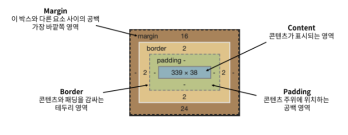

# # Web - The box model

1. 개요
- CSS Box Model : 모든 HTML 요소를 (사각형) 박스로 표현
- 웹사이트는 크고 작은 네모 박스로 구성되어 있음

<br>

2. 구성 요소 
- CSS Box Model : `박스에 대한 크기, 여백, 테두리 등의 스타일을 지정하는 디자인 개념`
- Box의 구성


- box 구성의 방향 별 명칭
    - box 구성에 방향만 붙혀주면 됨
    - ex) margin-left, border-bottom, padding-right

<br>

- `width & height` 속성
    - 요소의 너비와 높이를 지정
    - 이때 지정되는 요소의 너비와 높이는 콘텐츠 영역을 대상으로 함

<br>

- box-sizing 속성
    - 요소의 너비와 높이를 계산하는 방법을 지정
```html
* {
    box-sizing: content-box;
}

-----------------------------
* {
    box-sizing: border-box;
}
```

<br>

3. 박스 타입
- Block & Inline
```html
.index {
    display: block;
}

-----------------------
.index {
    display: inline;
}
```

<br>

- Normal flow
    - CSS를 적용하지 않았을 경우 Block 및 Inine 요소가 기본적으로 배치되는 방향
- `block 타입 특징`
    - 항상 새로운 행으로 나뉨
    - width와 height 속성을 사용하여 너비와 높이를 지정할 수 있음
    - 기본적으로 width 속성을 지정하지 않으면 박스는 inline 방향으로 사용 가능한 공간을 모두 차지함 (너비를 사용가능한 공간의 100%로 채우는 것)
    - 대표적인 block 타입 태그
        - `h1~6`, `p`, `div`
- `inline 타입 특징`
    - 새로운 행으로 나뉘지 않음
    - width와 height 속성을 사용할 수 없음
    - 수직 방향
        - padding, margin, borders가 적용되지만 다른 요소를 밀어낼 수는 없음
    - 수평 방향
        - padding, margin, borders가 적용되어 다른 요소를 밀어낼 수 있음
    - 대표적인 inline 타입 태그
        - `a`, `img`, `span`

<br>

### # 참고
- shorthand 속성 - `border`
    - border-width, border-style, border-color를 한번에 설정하기 위한 속성
```html
<!-- 순서는 영향을 주지 않음 -->
 border: 1px solid black;
```

<br>

- shorthand 속성 - `margin & padding`
    - 4방향의 속성을 각각 지정하지 않고 한번에 지정할 수 있는 속성

```html
<!-- 4개 - 상하좌우 -->
margin: 10px 20px 30px 40px;
padding: 10px 20px 30px 40px;

<!-- 3개 - 상/좌우/하 -->
margin: 10px 20px 30px;
padding: 10px 20px 30px;

<!-- 2개 - 상하/좌우 -->
margin: 10px 20px;
padding: 10px 20px;

<!-- 1개 - 공통 -->
margin: 10px;
padding: 10px;
```

<br>

- `display: inline-block`
    - inline과 block 요소 사이의 중간 지점을 제공하는 display 값
    - 요소가 줄 바꿈 되는 것을 원하지 않으면서 너비와 높이를 적용하고 싶은 경우에 사용
    - block 요소의 특징을 가짐
        - 너비 및 높이 속성이 준수
        - 패딩, 여백 및 테두리로 인해 다른 요소가 상자에서 밀려난다.

<br>

- Margin collapsing (마진 상쇄)
    - 두 block 타입 요소의 margin top과 bottom이 만나 큰 margin으로 결합되는 현상
    - 웹 개발자가 레이아웃을 더욱 쉽게 관리할 수 있도록 함
        - 각 요소에 대한 상/하 margin을 각각 설정하지 않고 한 요소에 대해서만 설정할 수 있음

