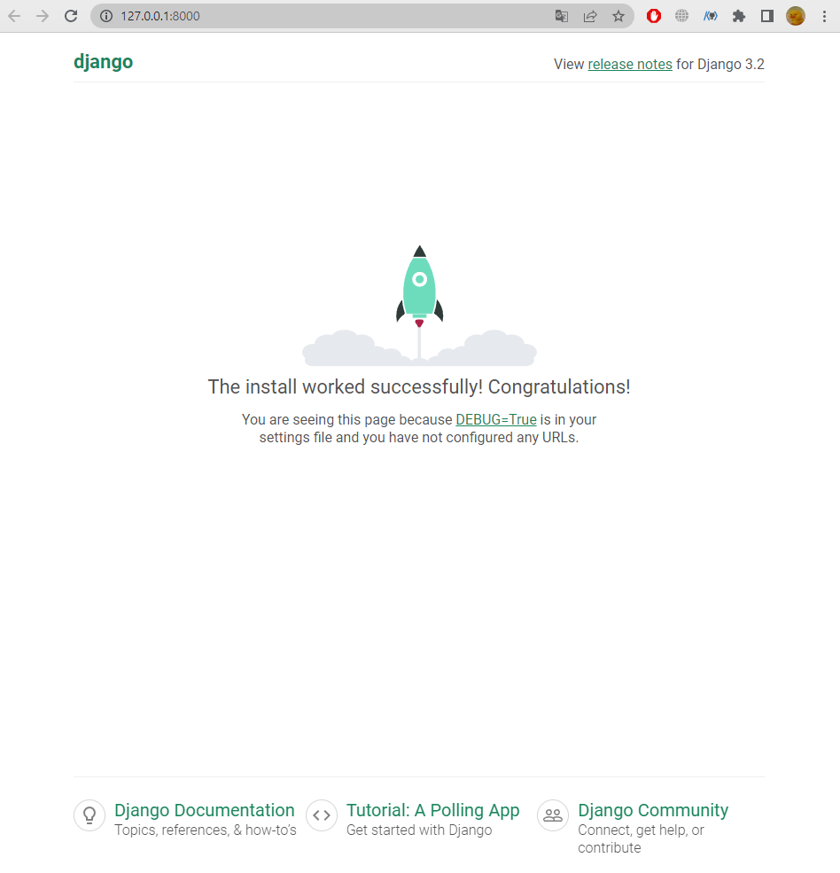

# 01. Django - Understanding Django and framework

### # 개요
- '웹 서비스 개발'에는 무엇이 필요할까?
    - 로그인, 로그아웃, 회원관리, 데이터베이스, 보안 등.. 너무 많은 기술이 필요
    - 하지만 모든 걸 직접 만들 필요가 없음
    - 잘 만들어진 것들을 가져와 좋은 환경에서 잘 사용하기만 하면 되는 세상 -> `거인의 어깨 위에서 프로그래밍하기`

<br>

### # Framework
- 웹 애플리케이션을 빠르게 개발할 수 있도록 도와주는 도구 (개발에 필요한 기본 구조, 규칙, 라이브러리 등을 제공)

- 왜 프레임워크를 사용할까?
    - 기본적인 구조와 규칙을 제공하기 때문에 필수적인 개발에만 집중할 수 있음
    - 여러 라이브러리를 제공해 개발 속도를 빠르게 할 수 있음
    - 유지보수와 확장에 용이해 소프트웨어의 품질을 높임

<br>

### # django
- `Python` 기반의 대표적인 `웹 프레임워크`
    - 검증된 웹 프레임워크
    - 대규모 서비스에서도 안정적인 서비스 제공

<br>

### # 클라이언트와 서버
- `🌟클라이언트 - 서버 구조🌟`

- `Clint` : 서비스를 요청하는 주체 (웹 사용자의 인터넷이 연결된 장치, 웹 브라우저)
- `Server` : 클라이언트의 요청에 응답하는 주체 (웹 페이지, 앱을 저장하는 컴퓨터)

- 우리가 웹 페이지를 보게되는 과정
    - 웹 브라우저`(클라이언트)`에서 'google.com'을 입력
    - 브라우저는 인터넷에 연결된 전세계 어딘가에 있는 구글 컴퓨터 `(서버)`에게 'Google 홈페이지.html' 파일을 달라고 요청
    - 요청을 받은 구글 컴퓨터는 데이터베이스에서 'Google 홈페이지.html' 파일을 찾아 우리 컴퓨터에게 응답
    - 전달받은 'Google 홈페이지.html' 파일을 웹 브라우저가 사람이 볼 수 있도록 해석해주면서 구글의 메인 페이지를 보게 됨

- `django를 사용해서 서버(server)를 구현할 것`

<br>

### # django 프로젝트 및 가상환경
- django 프로젝트 생성 전 루틴
    - 가상환경 생성
    - 가상환경 활성화
    - django 설치
    - 의존성 파일 생성 (패키지 설치시마다 진행)

----------------------------------------------------------------
### # 프로젝트 생성 및 서버 실행

1. 가상환경 생성 및 활성화
    - 가상환경 이름 : `venv`

    - venv 라는 이름은 변경 x
```
$ python -m venv venv
```
```
$ source venv/Scripts/activate
```

<br>

2. `django` 설치
    - 설치 버전 : 3.2.18 (현 LTS)
```
$ pip install django==3.2.18
```

<br>

3. 의존성 파일 `requirements.txt` 생성
    - requirements 라는 이름은 변경 x
```
$ pip freeze > requirement.text
```

<br>

4. django 프로젝트 생성
```
$ django-admin startproject firstpjt .
```

<br>

- 아래는 vscode로 진행
5. django 서버 실행
    - `반드시 vscode 내에 터미널이 켜져있지않은 상태로 진행`
    - vscode에서 `interpreter`로 가상환경을 켜 줌

    - 그 후 터미널을 새로 열면 source ~... 명령어가 돌면서 가상환경이 켜짐
    - `python manage.py runserver`를 하면 링크를 클릭해 로켓 발사 화면을 볼 수 있음 (아무것도 하지 않았을 때 보이는 화면)
    - 프로젝트 시작하고 이 화면이 안보이면 문제가 있다는 뜻


- 서버 종료 : `ctrl + c`


<br>
<br>

### # 선택사항 (git push를 하는 상황이라면)

- `!주의 : 밑의 명령어들은 git add . 을 하기 전에 실행할 것 `

- .gitignore 작성
    - [gitignore.io](https://www.toptal.com/developers/gitignore/) 활용 .gitignore 파일 생성
    - 사이트에 접속 후 입력창에 Django, Windows, macOS, VisualStudioCode 등의 단어 입력 
- git init 입력
    - git init으로 초기화 진행

<br>

### # 그 외
- `deactivate` 입력 시 가상환경을 끌 수 있음 (잘 안 씀)
- 가상환경을 공유하기 위해선 상대에게 기록지(의존성 목록)를 준다. = 가상환경 자체를 공유하지 않음
- manage.py가 있는 곳에서 서버를 켜야 활성화 할 수 있음
- 내가 만약 페어로서 파일을 받는다면 가상환경을 만든 후, `pip install -r requirement.text` 로 의존성 파일 불러오기

<br>

----------------------------------------------------------------

### # 참고
- django 프로젝트 생성 루틴 정리

1. 가상환경 생성
2. 가상환경 활성화
3. django 설치
4. 의존성 파일 생성 (패키지 설치시마다 진행)
5. .gitignore 파일 생성 (첫 add 전)
6. git 저장소 생성
7. django 프로젝트 생성

#### `# 5, 6번은 git 관련 설정 시에 진행`

<br>

- 가상환경을 사용하는 이유
    - `의존성 관리` : 라이브러리 및 패키지를 각 프로젝트마다 독립적으로 사용 가능
    - `팀 프로젝트 협업` : 모든 팀원이 동일한 환경과 의존성 위에서 작업하여 버전간 충돌을 방지

<br>

- LTS (Long-Term Support)
    - 프레임워크나 라이브러리 등의 소프트웨어에서 장기간 지원되는 안정적인 버전을 의미할 때 사용
    - 기업이나 대규모 프로젝트에서는 소프트웨어 업그레이드에 많은 비용과 시간이 필요하기 때문에 안정적이고 장기간 지원되는 버전이 필요

<br>

- gitignore 설정 서비스
    - https://www.toptal.com/developers/gitignore/


