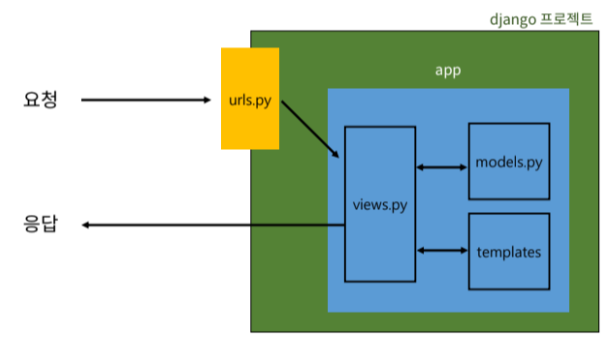

# 02. Django - Django design pattern

## # django 프로젝트와 앱
- `django project` : 애플리케이션의 집합 (DB 설정, URL 연결, 전체 앱 설정 등을 처리)

- `django application` : 독립적으로 작동하는 기능 단위 모듈 (각자 특정한 기능을 담당하며 다른 앱들과 함께 하나의 프로젝트를 구성)
    - `MTV 패턴에 해당하는 파일 및 폴더를 담당`


<br>

1. 앱 생성
    - 앱의 이름은 `복수형`으로 지정하는 것을 권장
```
$ python manage.py startapp articles
```

<br>

2. 앱 등록
    - `반드시 앱을 생성한 후에 등록`해야 함
    - 반대로 등록 후 생성은 불가능 (앱이 안만들어짐)
```
firstpjt 폴더 -> 
    setting.py -> 
        INSTALLED_APPS = [ ... ] 맨 위에 'articles', 를 넣어주며 앱을 등록해준다.
```

<br>

## # django 디자인 패턴
- (소프트웨어) `디자인 패턴` : 소프트웨어 설계에서 발생하는 문제를 해결하기 위한 일반적인 해결책 (공통적인 문제를 해결하는데 쓰이는 형식화 된 관행)

- `MVC 디자인 패턴 (Model - View - Controller)` : 애플리케이션을 구조화하는 대표적인 패턴 (데이터, 사용자 인터페이스, 비즈니스 로직을 분리)
    - `시각적 요소와 뒤에서 실행되는 로직을 서로 영향 없이, 독립적이고 쉽게 유지보수할 수 있는 애플리케이션을 만들기 위해`

- `MTV 디자인 패턴 (Model - Template - View)` : django에서 애플리케이션을 구조화하는 패턴 (기존 MVC 패턴과 동일하나 명칭을 다르게 정의)
    - View -> Template
    - Controller -> View

<br>

- 프로젝트 구조
```py
firstpjt)

setting.py - 프로젝트의 모든 설정을 관리

urls.py - URL과 이에 해당하는 적절한 views를 연결

# 현재는 위 두 파일만 알면 됨

-------------------------------------------

__init__.py - 해당 폴더를 패키지로 인식하도록 설정

asgi.py - 비동기식 웹 서버와의 연결 관련 설정

wsgi.py - 웹 서버와의 연결 관련 설정

manage.py - Django 프로젝트와 다양한 방법으로 상호작용 하는 커맨드라인 유틸리티

# 위 4개 파일은 현재 단계에서는 별도로 수정하지 않음
```

<br>

- 앱 구조
    - MTV의 T는 기본적으로 자동으로 등장하진 않음 (우리가 만들어줘야 함)
```py
articles)

admin.py - 관리자용 페이지 설정

models.py - DB와 관련된 Model을 정의
          - MTV 패턴의 M

views.py - HTTP 요청을 처리하고 해당 요청에 대한 응답을 반환 (url, mode, template과 연계)
         - MTV 패턴의 V
         - 가장 중요한 파일이 될 것이다. (controller 역할이라) 

-------------------------------------------

apps.py - 앱의 정보가 작성된 곳

tests.py - 프로젝트 테스트 코드를 작성하는 곳

__init__.py

# 위 3개 파일은 현재 단계에서는 별도로 수정하지 않음
```



<br>

## # 요청과 응답

- URLs
    - http://128.0.0.1:8000/`articles/` 로 요청이 왔을 때 `views` 모듈의 `index` 뷰 함수를 호출한다는 뜻
```py
# urls.py 입장에서는 articles라는 패키지에서
# views라는 모듈을 가져와야 함

firstpjt ->
    urls.py ->
        from articles import views 추가
            -> urlpatterns = [ ... ] 에 path('articles/', views.index) 추가


# views.index 함수안에 인자로 들어가는 함수 -> 콜백 함수

# path('articles/',views.index()) => 2번째 인자로 index함수의 반환 값 - 이렇게 쓰면 안됨. 값이 완전 달라짐
```

<br>

- View
    - 특정 경로에 있는 template과 request 객체를 결합해 응답 객체를 반환하는 index view 함수 정의
```py
# 페이지를 만들어내는 함수 render
from django.shortcuts import render

# 특정 기능을 수행하는 view 함수를 만듦
# 모든 view 함수는 첫번째 인자로 요청 객체를 필수적으로 받는다.

articles ->    
    views.py -> 
        def index(request):
    return render(request, 'index.html') 추가
```

<br>

- Template
```py
1. articles 앱 폴더안에 templates 폴더 생성
2. templates 폴더 안에 템플릿 페이지 작성

# 반드시 templates 폴더명이어야 하며 개발자가 직접 생성해야 함
```

<br>

- django에서 template을 인식하는 경로 규칙
```
app폴더 / templates / articles / index.html

app폴더 / templates / example.html
                    
                    ↑

django는 이 지점까지 기본 경로로 인식하기 때문에 이 지점 이후의 templates 경로를 작성해야 함
```

<br>

- 페이지 확인
    - 콘솔 창에 python manage.py runserver 입력
    - 링크 창에 http://127.0.0.1:8000/articles/ 입력
    - 입력 후 정상적으로 나오면 성공!
    - 새로고침 하면 요청을 또 보낸 것이므로 로그에 남는 것이다.

<br>

> 데이터 흐름이 코딩 순서
```
*** URLs -> View -> Template ***
```

<br>

### # 참고
- MTV 디자인 패턴 정리
    - Model
        - 데이터와 관련된 로직을 관리
        - 응용프로그램의 데이터 구조를 정의하고 데이터베이스의 기록을 관리

    - Template
        - 레이아웃과 화면을 처리
        - 화면상의 사용자 인터페이스 구조와 레이아웃을 정의

    - View
        - Model & Template과 관련한 로직을 처리해서 응답을 반환
        - 클라이언트의 요청에 대해 처리를 분기하는 역할
        - 데이터가 필요하다면 model에 접근해서 데이터를 가져오고 가져온 데이터를 template로 보내 화면을 구성하고 구성된 화면을 응답으로 만들어 클라이언트에게 반환

<br>

- render 함수
```
render(request, template_name, context)


- 주어진 템플릿을 주어진 컨텍스트 데이터와 결합하고 렌더링 된 텍스트와 함께 HttpResponse(응답) 객체를 반환하는 함수
```

- request : 응답을 생성하는 데 사용되는 요청 객체

- template_name : 템플릿 이름의 경로

- context : 템플릿에서 사용할 데이터 (딕셔너리 타입으로 작성)

<br>

### # 실습하며 발생한 문제점 : 
1. view에서 html파일을 지정해줄 때 return render(request, 'berners_lee.html') 인데
교재를 보고 따라하다 return render(request, 'berners_lee/berners_lee.html')로 지정해버림
기본 경로에서 하위 폴더가 없는 상태인데 하위폴더를 지정해주다 보니 페이지를 찾지 못한다고 에러가 뜬 것
django에서 template을 인식하는 경로 규칙을 주의할 것!!

2. templates 파일 내부에 이미지를 넣어도 페이지에선 이미지가 깨지는 것을 확인.
그래서 이미지를 넣을 때 링크로 넣어야 한다는 것을 알게 됨.

