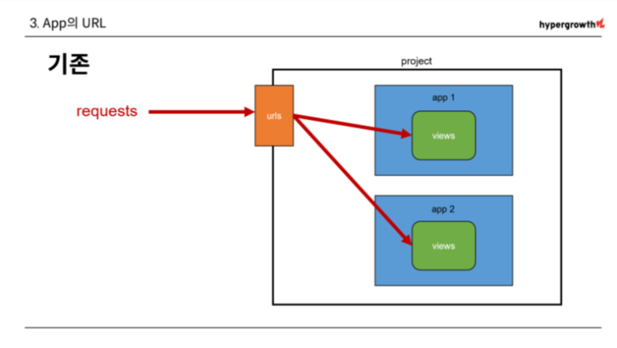
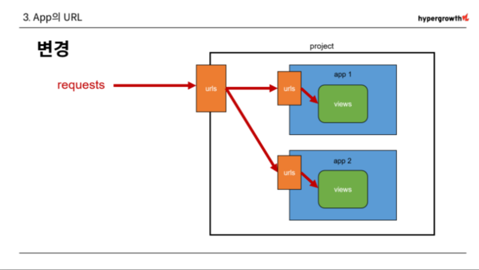

# 04. django - django URLs
- URL dispatcher : URL 패턴을 정의하고 해당 패턴이 일치하는 요청을 처리할 view 함수를 연결 (매핑)

<br>

## # 변수와 URL
- 템플릿의 많은 부분이 중복되고, URL의 일부만 변경되는 상황이라면 계속해서 비슷한 URL과 템플릿을 작성해 나가야 할까?
```py
urlpatterns = [
    path('artilcels/1/', ...),
    path('artilcels/2/', ...),
    path('artilcels/3/', ...),
    path('artilcels/4/', ...),
    ... ,
]
```

<br>

- `Variable Routing` : URL 일부에 변수를 포함시키는 것 (변수는 view 함수의 인자로 전달 할 수 있음)
```py
Variable Routing 작성법)

<path_converter : variable_name> - 타입 : 변수 이름

path('articles/<int:num>/', views.hello)
path('hello/<str:name>/', views.greeting)
```

<br>

- `Path converters` : URL 변수의 타입을 지정 (str, int 등 5가지 타입 지원)
```py
# urls.py

urlpatterns = [
    path('<int:num>/', views.detail),
]


# views.py

def detail (request, num):
    # num 변수로 DB에서 몇 번 글을 조회하는지 검색할 때 사용 

    context = {
        'num' : num,
    }
    return render(request, 'detail.html', context)


# detail.html




    <h1>Detail</h1>
    <h1>지금은 {{ num }}번 글 입니다.</h1>   

```

<br>

## # App의 URL

- `App URL mapping` : 각 앱에 URL을 정의하는 것
    - 프로젝트와 각각의 앱 URL을 나누어 관리하여 주소 관리를 편하게 하기 위함




<br>

- `include()` : 다른 URL들을 참조할 수 있도록 돕는 함수 (URL의 그 시점까지 일치하는 부분을 잘라내고, 남은 문자열 부분의 후속 처리를 위해 include된 URL로 전달)
```py
# firstpjt/urls.py

from django.urls import path, include

urlpatterns = [
    path('admin/', admin.site.urls),
    path('articles/', include('articles.urls')),
    path('pages/', include('pages.urls')),
]
```

<br>

## # URL 이름 지정

- 기존 'articles/' 주소가 'articles/index/' 로 변경됨
- url을 한 곳에서 관리 하려 했기 때문에 여러 문제 발생

```py
# firstpjt/urls.py

path('articles/', include('articles.urls'))


# articles/urls.py

path('index/', views.index, name='index')


- 기존에 articles/ 주소를 사용했던 모든 위치를 찾아 변경해야 함
```

<br>

- `Naming URL patterns` : URL에 이름을 지정하는 것 (path 함수의 name 인자를 정의해서 사용)

```py
- name 인자 작성

# articles/urls.py

urlpatterns = [
    path('admin/', admin.site.urls),
    path('articles/', views.articles , name ='articles'),
    path('pages/', include('pages.urls')),
]


# pages/urls.py

urlpatterns = [
    path('index/', views.index, name='index'),
    path('hello/<str:name>/', views.greeting, name='greeting'),
]
```

<br>

- `URL 표기 변화`
```py
# articles/index.html




    <h1>Greeting</h1>
    <h3>{{ name }}님 안녕하세요!</h3>
    <a href="/articles/">두번째 페이지</a>


                        ↓




    <h1>Greeting</h1>
    <h3>{{ name }}님 안녕하세요!</h3>
    <a href="">두번째 페이지</a>



# href 속성 값 뿐만 아니라 form의 action 속성 처럼 url을 작성하는 모든 위치에서 변경
```

<br>

- `url` tag : 주어진 URL 패턴의 이름과 일치하는 절대 경로 주소를 반환
```py

```

<br>

## # URL Namespace

- articles 앱의 url 이름과 pages 앱의 url 이름이 같음. 단순히 이름만으로는 분리가 어려운 상황
```py
# articles/urls.py

path('index/', views.index, name='index')


# pages/urls.py

path('index/', views.index, name='index')
```

<br>

- `app_name 속성 지정` : url 이름 + app 이름표 붙이기
```py
# articles/urls.py

app_name = 'articles'
urlpatterns = [
    ... ,
]


# pages/urls.py

app_name = 'pages'
urlpatterns = [
    ... ,
]
```

<br>

- `URL tag의 변화`
```py


        ↓


```

<br>

## # 참고
- app_name 지정 후 주의사항
    - app_name을 지정한 이후에는 url 태그에서 반드시 app_name:url_name 형태로만 사용할 수 있음

    - 그렇지 않으면 NoReverseMatch 에러가 발생
    - 즉, app_name 지정 후 다음과 같은 표기는 사용 불가
    - ``


- Trailing Slashes
    - django는 URL끝에 `/`가 없다면 자동으로 붙임
    - django의 url 설계 철학
        - 기술적인 측면에서 app.com/bar와 app.com/bar/는 서로 다른 URL이다.
    
    - 검색 엔진 로봇이나 웹 트래픽 분석 도구에서는 이 두 주소를 서로 다른 페이지로 봄
    - 그래서 django는 검색 엔진이 혼동하지 않게 하기 위해 사용
    - 그러나 모든 프레임워크가 이렇게 동작하는 것은 아님

    