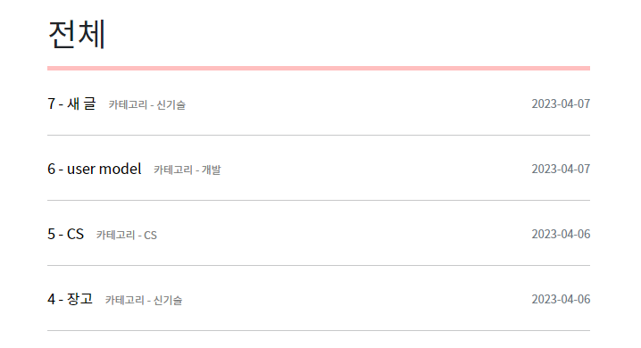
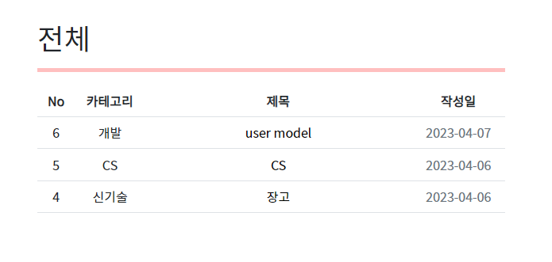

# # 0407_Django project_2

### `# 프로젝트 주제`
- 개발자 정보 공유 서비스

- Model 정보가 주어졌을 때 Django Model을 설계할 수 있다.
- CRUD 기능이 탑재된 웹 서비스를 개발할 수 있다.
- 회원 관리 기능을 구현할 수 있다.
- 커뮤니티 서비스의 웹 페이지를 디자인 할 수 있다.

<br>

### `# 담당 역할`
- 팀원들과 함께 코드를 다듬으며 각각의 페이지에서 구현한 기능들이 제대로 작동하는지 확인하고, 추가로 구현할 기능들을 넣고 페이지를 꾸밈

<br>

### `# 변경사항 및 알게된 점`

- `hover` 라는 기능을 활용해 해당 카테고리에 마우스 커서를 올려놨을 때 색깔이 gray -> black으로 바뀔 수 있게 함

```py
# !base.html

.category {
        color: gray;
      }

.category:hover {
        color: black
      }
```

<br>
<br>

- `order_by('-pk')`를 추가해 글이 새로 생성되는 순(내림차순)으로 화면에 뜰 수 있게함

```py
# posts/views.py

def base(request):
    posts = Post.objects.order_by('-pk')

def category(request, subject):
    posts = Post.objects.filter(category=subject).order_by('-pk')
```

<br>
<br>

- 회원가입 시 비밀번호가 조건에 맞지 않으면 아무런 경고 문구가 뜨지 않고 회원가입 사이트에 머무르는 문제 발생 
    - https://m.blog.naver.com/headfat1218/221948948937
    - https://stackoverflow.com/questions/33247469/django-password-dont-match-error-message-not-displaying-customised-userauth-a

- 위 사이트를 참고해 아래 코드를 넣어줬더니 경고 문구가 나오며 회원가입을 막을 수 있도록 함
```html
<!-- accounts/signup.html -->


    
      
        <div class="alert alert-danger">
          <strong>{{ error|escape }}</strong>
        </div>
      
    
    
    
      <div class="alert alert-danger">
        <strong>{{ error|escape }}</strong>
      </div><br>
    
  
```

<br>
<br>

- 기존의 메인 페이지를 아래 형식에서
```html

<div class="d-flex justify-content-between align-items-center my-4">

  <a href=""><p class="m-0">{{ post.pk }} - {{ post.title }} <span class="cate">카테고리 - {{ post.category }}</span></p></a>

  <span class="created_at">{{ post.created_at|date:"Y-m-d" }}</span>
</div>
<hr>

```

- 아래와 같은 테이블 형식으로 바꿈
```html
<table class="table table-hover text-center">
  <thead>
    <tr>
      <th scope="col">No</th>
      <th scope="col">카테고리</th>
      <th scope="col">제목</th>
      <th scope="col">작성일</th>
    </tr>
  </thead>
  <tbody class="">
    
    <tr></tr>
      <td scope="row" style="width: 8%">{{ post.pk }}</td>
      <td style="width: 15%">{{ post.category }}</td>
      <td><a href="">{{ post.title }}</a></td>
      <td class="text-secondary" style="width: 20%">{{ post.created_at|date:"Y-m-d" }}</td>
    </tr>
    
    
  </tbody>
</table>
```



<br>
<br>

- 시계 위젯 추가
    - https://booked.kr/widgets/clock


<br>
<br>

- 그 외 발견한 문제
    - 내가 쓴 글이 아닌 상대방의 글을 맘대로 삭제할 수 있음 -> 이 내용은 추후에 배울 내용이라 아직 적용하지 못함

<br>
<br>

### `# 프로젝트 후기`
- 어제 진행한 프로젝트를 이어서 만들게 되었다. 이번엔 수정할 기능을 조금씩 수정하고, 대체적으로 디자인적인 요소를 추가하였다. 

- 프로젝트를 진행하며 기존에 헷갈렸던 부분이나 몰랐던 부분을 많이 알게 돼서 굉장히 유익했던 시간이었다.


