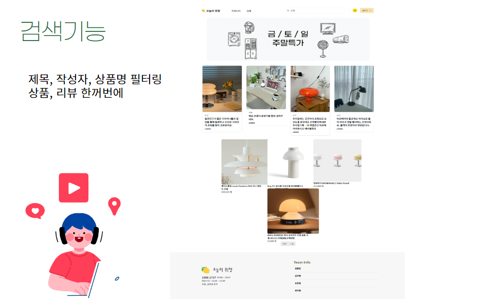

# # 0508_Semi Project 회고

```
- 회고를 통해 동일 사건에 대해 새로운 이야기를 만들어 낼 수 있어야 한다.

- 시각의 변화 => 회고를 통해 시각의 전환이 일어나야 좋다는 것

- 내 성장의 피드백 사이클을 짧게 하라.

- 부정적인 내용을 좋은 형태로 인정하고 넘어가면 회고의 효과가 더 좋아진다.
```

## # `프로젝트 주제`

- 콘텐츠 정보 제공 및 후기 공유 커뮤니티 서비스를 개발

    - 상품 정보 및 후기 공유 커뮤니티 서비스 - 예시) 오늘의 집

<br>

## # `프로젝트 개요`
- 기존에 배운 내용을 토대로 주요 기능 위주의 개발을 하며, 해당 페이지를 최대한 비슷하게 클론 코딩 해보는 것

<br>

## # `프로젝트 목적`
- 웹 프레임워크 Django와 HTML / CSS / JavaScript를 활용해서 콘텐츠 기반 커뮤니티 웹 플랫폼 서비스를 개발

<br>

## # `담당 역할`
- 프로젝트에 명세서에 나온 기능을 구현하기 위해 일단 팀 역할을 크게 백엔드, 프론트엔드 2가지로 나눴으나 그동안의 내용을 함께 복습하며 공부할 겸 django 부분의 기초적인 뼈대 부분은 팀원들과 함께 작성하기로 함

- 본인은 index 페이지, 상품 판매 페이지, 상품 상세 페이지, 검색 후 검색 결과 도출 페이지 위주로 프론트엔드, 백엔드 구현


<br>


## # `협업 방식`

- Figma를 이용한 UI 설계

- Github를 이용한 코드 관리

- Notion을 이용한 Daily Scrum

<br>

## # `개발 시 중점 사항`

- `누구를 위해, 어떤 문제를 풀기 위해 이 서비스를 만들었는가`

    - 생필품부터 조명, 반려동물 용품까지 사소한 물건이더라도 개인의 '취향'이 담기기 마련

    - 서로의 취향을 '공유'하고 제품을 구매할 때 유용한 '정보'를 얻기 위한 서비스를 구현

    - 기존에는 개인의 취향에 대해 공유하며 정보를 주고 받는 사이트들이 많지 않았음. 그렇기에 사용자들이 개인의 취향을 공유하며, `정보`를 주고 받으면 좋을 것 같다는 생각에 해당 페이지 개발을 시작하였다.


<br>

## # `주요 기능 소개`

- 메인 페이지


- 로그인


- 프로필 페이지


- 리뷰 생성


- 리뷰 상세 페이지


- 리뷰어 팔로우 관련


- 리뷰 페이지 댓글 좋아요


- 상품 페이지


- 상품 카테고리


- 상품 - 오늘의 딜


- 상품 상세 페이지


- 검색 기능


<br>

## # `기능 사용 이유`
- 제품 상세 페이지에서 메인 이미지 옆에 제품 이미지들이 나열되어 있는데 클릭시 해당 이미지가 modal로 뜨게 함. 왜 modal을 썼는가?
    
    - 처음에는 해당 이미지를 클릭하면 메인 이미지 자리에 해당 이미지가 뜰 수 있도록 구현하고 싶다 생각 했었지만, 현실적으로 아직 JS 실력이 부족해 구현에 어려움이 있었기에 대신 modal로 해당 이미지가 뜰 수 있도록 처리하였다.

<br>

## # `개발하면서 겪은 어려움`

- django 부분에서 오류가 나면 해결하는데 시간이 많이 걸렸던 것 같다.

<br>

- 처음 진행하는 프로젝트다 보니 어떤 방향으로 개발을 해야 할지 몰라 ERD나 모델 작성을 먼저하기 보단 무작정 개발을 먼저 진행하여 개발 방향에 대해 몇 번 헤맸던 것 같다. 다음 프로젝트에선 큰 틀과 방향같은 세부사항을 먼저 잡은 후 개발을 진행하는 것이 좋을 것 같다.

    - 시도해 본 해결 방안? 개발 도중 개발 방향에 대한 확신이 서지 않을 때, 데일리 스크럼을 통해 문제점 파악 후 해결 방법에 대한 의견 수렴 -> 추후 개발 방향 및 세부사항 결정 / 데일리 스크럼을 통해 의견을 모으고, 개발의 방향을 정해 나가는 것이 중요하다는 것을 깨달았다.

<br>

- 프론트엔드와 백엔드를 나누지 않고 함께 진행하다 보니 프론트엔드 프레임워크인 react나 vue에 대해 공부, 사용해보지 못한 것에 대한 아쉬움이 남은 것 같다.

<br>

## # `만약 여기서 더 기능을 추가한다면?`

- 별점 기능을 넣으려다 유저가 별점을 주면 그 데이터를 DB에 저장 후 총 별점을 연산하여 페이지에 출력하는 방식을 구현하지 못해 결국 기능을 넣지 못하였는데, 다음번 프로젝트에서 한번 더 시도해보고 싶다.

- 좋아요나 조회수 순으로 리뷰 정렬, 순위 매기기

- Q & A 기능

- chat gpt api

- 카카오톡, 네이버 로그인 api

<br>

## # `세미 프로젝트를 마치며`

- 아직 부족한 내용이 많지만 기존에 배운 내용과 더불어 추가 기능을 구현해냈다는 것에 만족! 완벽하진 않지만 무사히 완성해서 발표까지 해내서 다행이다ㅎㅎ

- 프론트엔드와 백엔드를 구분하지 않고 진행하니 현재 개발 상황에 대해 팀원들이 모두 숙지하고 있었으며, 만약 문제가 생기면 팀원들에게 공유하여 함께 문제를 해결할 수 있었다. 무엇보다 수업시간에 배운 내용을 복습하며 새로운 기능들을 구현하니 새롭기도 했지만 머리가 조금 아팠던 것 같기도,,,ㅎㅎ 첫 프로젝트라 부족한 점도 많고 구현하지 못한 기능도 많지만 좋은 팀원분들과 함께 하여 80% 정도는 구현할 수 있었던 것 같고, 이 프로젝트를 발판 삼아 다음 프로젝트 때는 더 성장할 수 있을 것 같아 매우 뜻깊은 시간이었다!

