# # 0519_Semi Project 2 회고

```
- 회고를 통해 동일 사건에 대해 새로운 이야기를 만들어 낼 수 있어야 한다.

- 시각의 변화 => 회고를 통해 시각의 전환이 일어나야 좋다는 것

- 내 성장의 피드백 사이클을 짧게 하라.

- 부정적인 내용을 좋은 형태로 인정하고 넘어가면 회고의 효과가 더 좋아진다.
```

## # `프로젝트 주제`

- 콘텐츠 정보 제공 및 후기 공유 커뮤니티 서비스를 개발

    - 상품 정보 및 후기 공유 커뮤니티 서비스 - 예시) 오늘의 집

<br>

## # `프로젝트 개요`
- 판매, 구매하는 사장님을 위한 배달앱 서비스 개발, 타겟층에 맞게 기능을 구현, 배민상회처럼 소상공인을 위한 프로젝트

<br>

## # `프로젝트 목적`
- 웹 프레임워크 Django와 HTML / CSS / JavaScript를 활용해서 콘텐츠 기반 커뮤니티 웹 플랫폼 서비스를 개발

<br>

## # `담당 역할`
- 프로젝트에 명세서에 나온 기능을 구현하기 위해 팀 역할을 크게 백엔드, 프론트엔드 2가지로 나눴고, 본인은 프론트엔드를 맡음

- 회원가입 / 로그인 페이지
    - 회원가입 시 (필수)가 적혀 있는 사항은 반드시 체크해야 회원가입 가능
    - 로그인 시 유효성 체크 (아이디 또는 비밀번호가 올바르지 않습니다.)
 
- 상품 생성 페이지
    - 상품 이미지 미리보기 구현

- 상품 상세 페이지
    - 상품 수량 조절 JS 구현

- 프로필 페이지


<br>


## # `협업 방식`

- Figma를 이용한 UI 설계

- Github를 이용한 코드 관리

- Notion을 이용한 Daily Scrum

<br>

## # `개발 시 중점 사항`

- `누구를 위해, 어떤 문제를 풀기 위해 이 서비스를 만들었는가`

    - 식재료 고민이 많은 사장님들을 위해 편리한 / 건강한 / 신선한 식재료 제공 서비스 개발


<br>

## # `주요 기능 소개`

- 메인 페이지
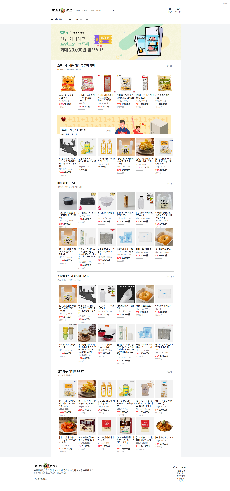

- 회원가입 / 로그인
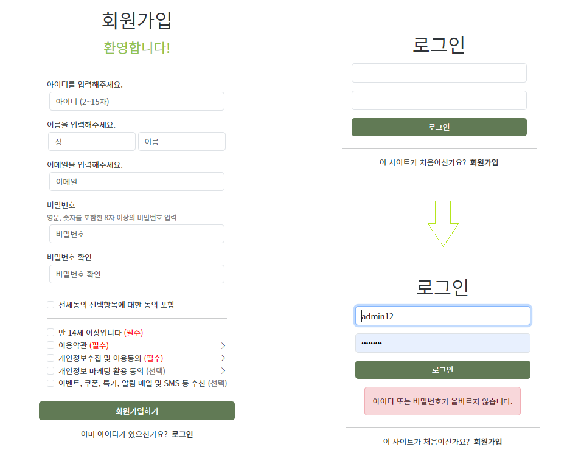

- 프로필 페이지
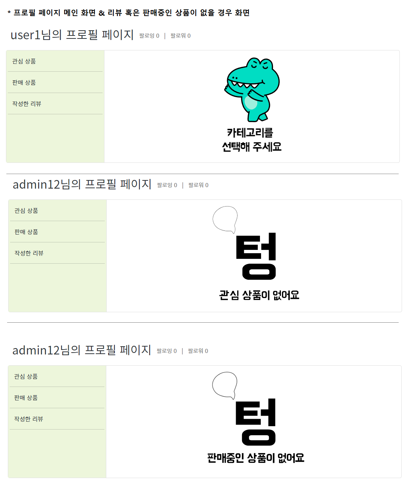
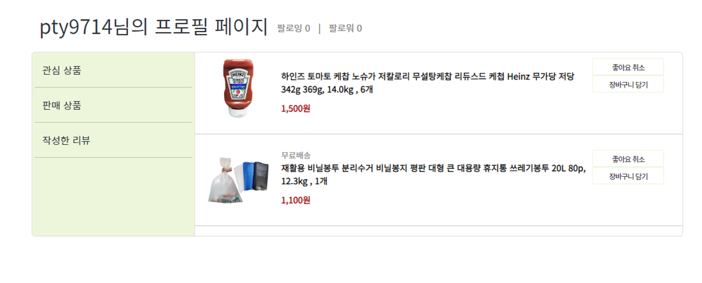

- 상품 상세 페이지
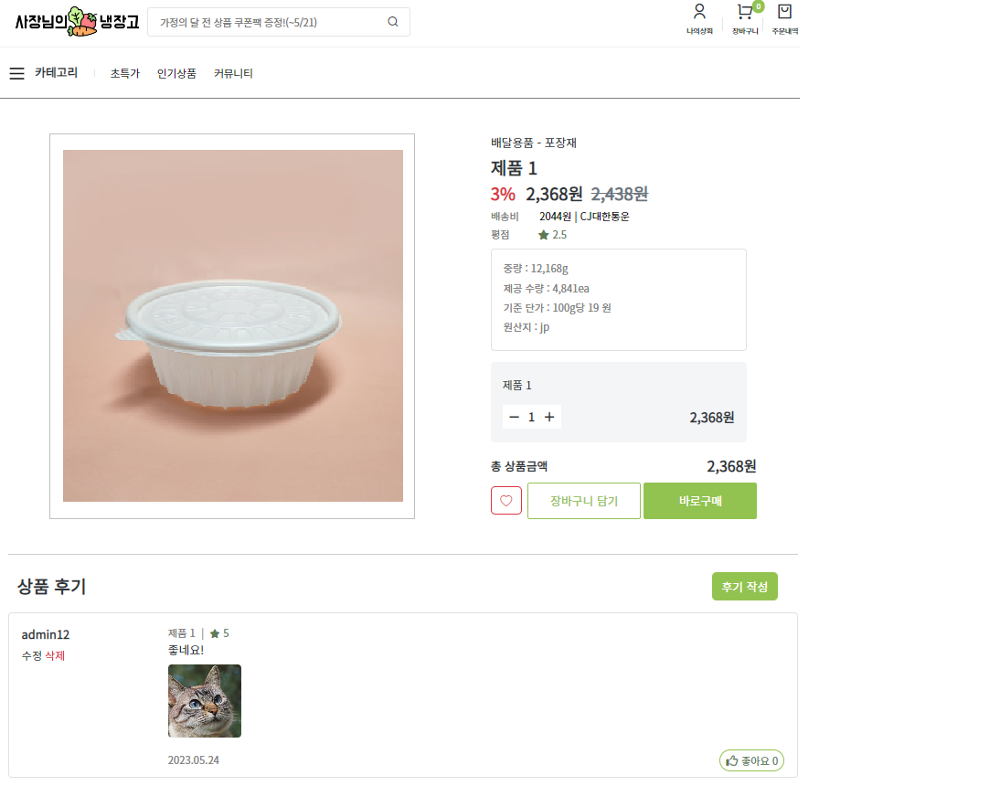

- 리뷰 생성
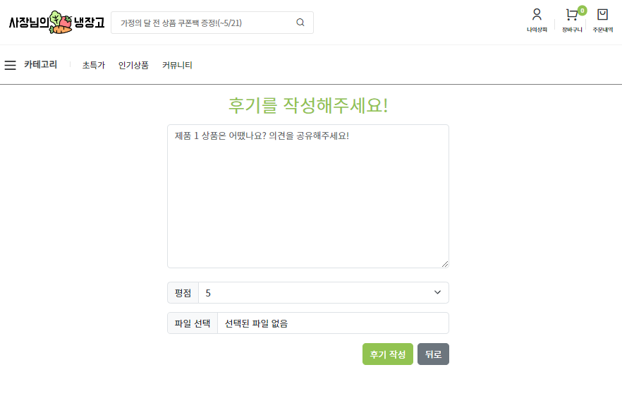

- 상품 댓글 좋아요
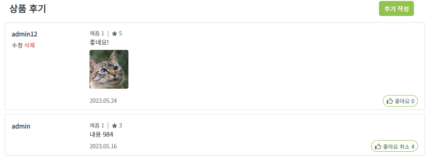

- 리뷰어 팔로우 관련
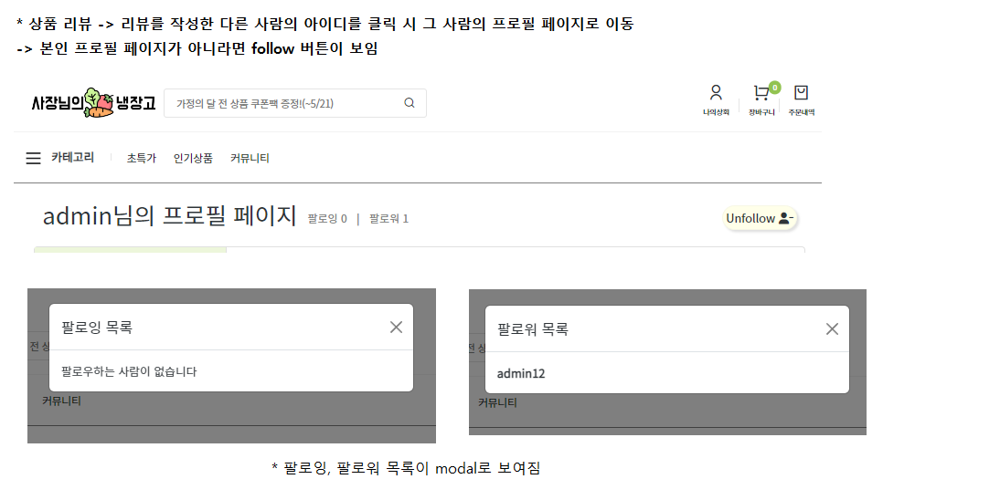

- 상품 카테고리
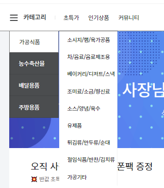

- 검색 기능
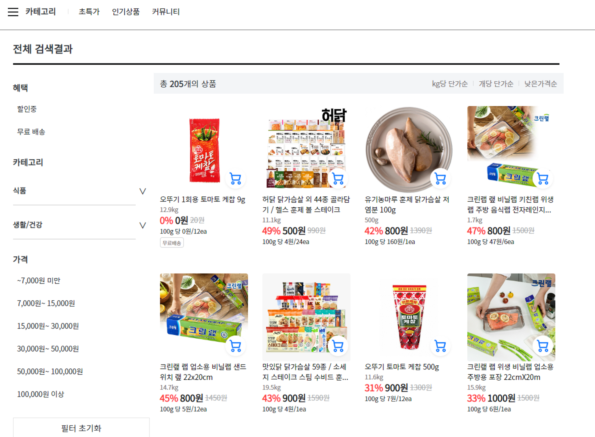

- 장바구니
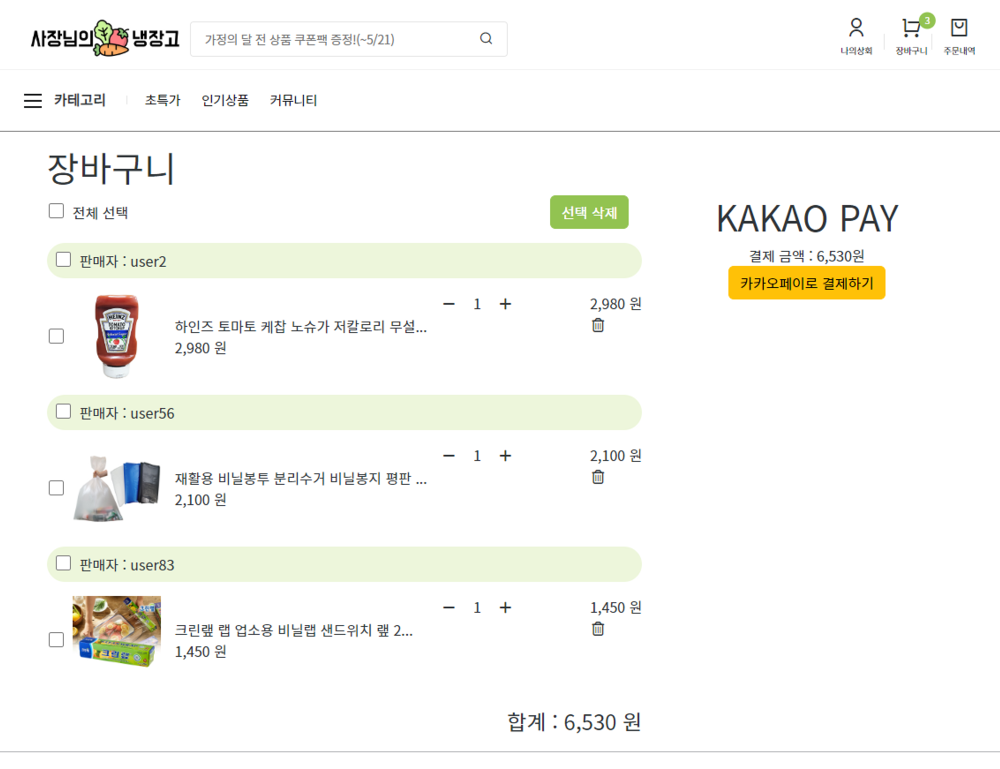

- 카카오페이 결제
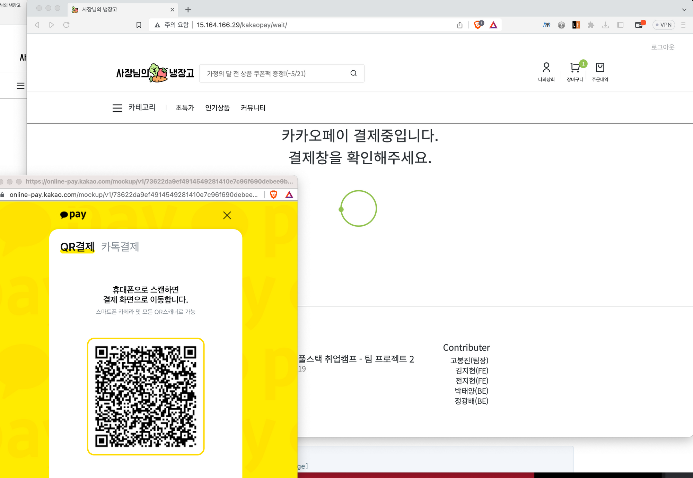

- 결제 완료 페이지
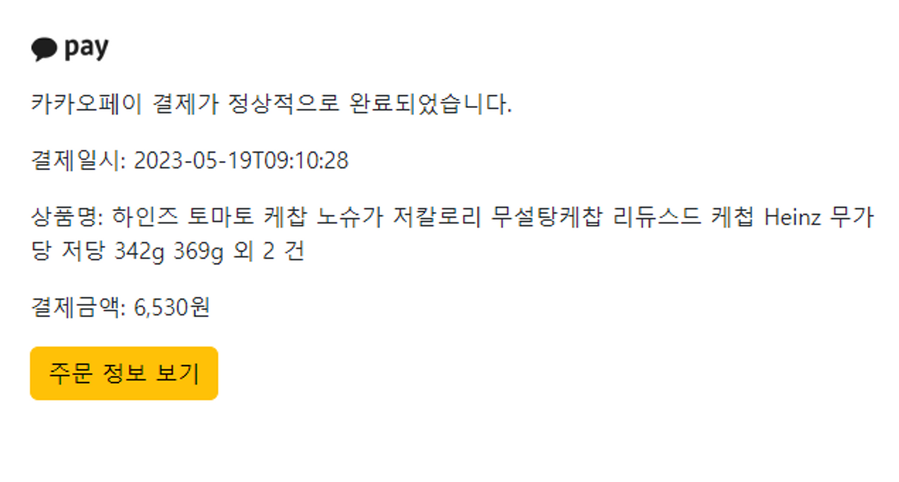

- 주문 내역
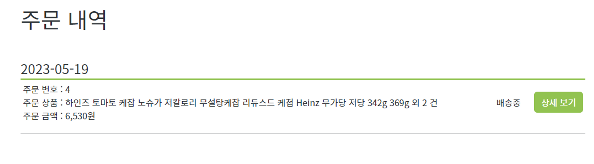

<br>

## # `개발하면서 겪은 어려움`

- 백엔드와 프론트엔드가 나눠지다 보니 개인적으로 백엔드 부분 코드에서 모르는 부분이 많고, 커뮤니케이션이 부족했던 것 같아 조금 아쉽다.

    - 수업 시간이 끝나고 전체적으로 코드 살펴보기

<br>

## # `만약 여기서 더 기능을 추가한다면?`

- 구매 정도에 따라 유저의 등급 매기기

- 카카오톡, 네이버 로그인 api

<br>

## # `두 번째 세미 프로젝트를 마치며`

- 내가 기여한 게 별로 없는 것 같아도 이런 경험을 한다는 것, 새롭게 무언가를 시도한다는 것 만으로도 좋은 경험이 되는 것 같다.

- 실력이 굉장한 팀원 분들을 만나 `AWS 배포`도 하고 `카카오페이`도 구현하며 이번 프로젝트는 나름 수월하게 진행됐던 것 같다.. 물론 각자 의견이 안 맞을 때도 있었지만 서로를 존중하며 대화를 통해 풀어나가는 `진정한 협업의 모습`도 볼 수 있었던 것 같다. 팀원분들이 많은 기능들을 뚝딱뚝딱 구현해 오시는데 개인적으로 한 게 별로 없는 것 같아 죄송하기도 한 느낌...ㅎㅠ 이번 프로젝트를 통해 모르는 것을 많이 배워가는 것 같아 정말 유익했던 시간이었다!

