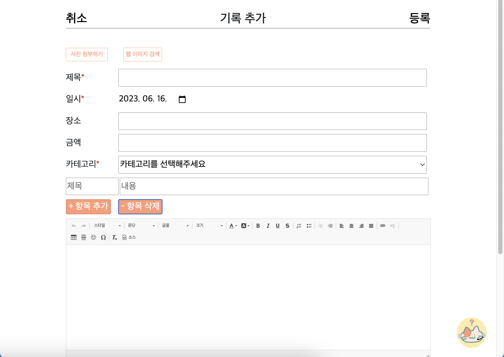
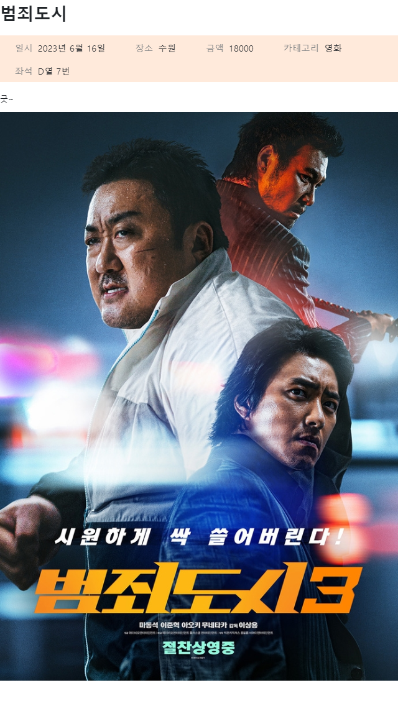

# # 0616_Final Project 회고

```
- 회고를 통해 동일 사건에 대해 새로운 이야기를 만들어 낼 수 있어야 한다.

- 시각의 변화 => 회고를 통해 시각의 전환이 일어나야 좋다는 것

- 내 성장의 피드백 사이클을 짧게 하라.

- 부정적인 내용을 좋은 형태로 인정하고 넘어가면 회고의 효과가 더 좋아진다.
```

## # `프로젝트 목적`
- 과정 중 학습하고, 경험한 것을 기반으로 서비스를 개발

- 주제 선정 / 기획 / 문서 등 모두 자율

<br>

## # `프로젝트 개요`
- 해당 서비스를 이용하는 사용자들은 다양한 문화생활에 대한 정보와 평가를 얻을 수 있으며, 문화생활에 관심이 있는 사람들끼리 소통할 수 있다.

- 티켓 커뮤니티 사이트를 통해 사용자는 자신의 문화 생활을 편리하게 기록하고, 그것을 한눈에 확인할 수 있는 기능을 제공. 이를 통해 사용자는 손쉽게 자신의 다양한 문화생활 참여와 리뷰, 문화 활동 일정을 정리하고, 소중한 경험을 시각적으로 파악할 수 있다.

<br>

## # `유저 페르소나`
- 문화 생활을 즐기는 사람들 (뮤지컬, 영화, 스포츠, 콘서트 등)

- 티켓을 모아 자랑하고 정보를 공유하고 싶어하는 사람들

- 기존 앱은 커뮤니티 서비스가 없어 단순 기록용 & 티켓 거래용으로 사용

<br>

## # `담당 역할`
- 팀 역할을 크게 백엔드, 프론트엔드 2가지로 나눴으며, 본인은 화면 구성, 프론트엔드를 맡음

- 회원가입, 로그인 페이지
    
    - 회원가입 시 (필수)가 적혀 있는 사항은 반드시 체크해야 회원가입 가능

    - reCAPTCHA를 활용한 보안 이미지 생성
    
    - 로그인 시 유효성 체크 (아이디 또는 비밀번호가 올바르지 않습니다.)

- index, base 페이지

- 캐릭터를 활용한 다양한 이미지 생성

<br>


## # `협업 방식`

- Figma를 이용한 UI 설계

- Github를 이용한 코드 관리

- Notion을 이용한 Daily Scrum

<br>

## # `개발 시 중점 사항`

- `사용자 중심의 서비스 개발`

    - 기존에 티켓을 기록하는 사이트가 어플로만 존재하였기에, 사이트에 기존 어플과는 다른 기능을 좀 더 추가하여 만들어보고 싶었다. 또한 개인의 문화 경험을 공유하며 공동의 문화생활을 만들어가고, 특별한 순간을 기억하고 공유하는 문화적 공간을 만들자는 취지하에 개발하게 되었다.

<br>

## # `주요 기능 소개`

- 메인 페이지


(기록 모아보기)

(챗 봇)


<br>

- 회원가입 / 로그인


<br>

- 프로필 페이지
(본인 프로필)

(다른 유저 프로필)

(다른 유저와 맞팔로우시 상대방 캘린더로 이동 가능)


<br>

- 기록 생성 페이지

(웹 이미지 검색 클릭시)


<br>

- 기록 상세 페이지


<br>

- 검색 페이지


<br>

- 캘린더 캡쳐 버튼 클릭 시


- 기록 캡쳐 버튼 클릭 시


<br>

## # `만약 여기서 더 기능을 추가한다면?`

- 다른 유저와 소통할 수 있는 커뮤니티 (게시판) 기능 추가

- 티켓 거래 기능

<br>

## # `최종 프로젝트를 마치며`

- 이번 최종 프로젝트를 진행하면서 기존에 배운 것들이 아닌 새로운 것을 많이 시도하면서 재밌게 임할 수 있었고, 프론트엔드로서 역량을 맘껏 펼칠 수 있었던 것 같다. 프로젝트 기간도 길고 주제도 자유인 만큼 주제를 정하는 것부터 많은 시행착오가 있었지만 멋진 팀원분들과 함께 서로의 의견을 존중하며 하나씩 차근차근 정해갈 수 있었던 것 같다.
이번 최종 프로젝트를 끝으로 과정은 마무리 되는데 개인적으로 프로젝트 중 리액트와 같은 프레임워크 사용에 어려움이 있어 사용하지 못한 점이 조금 아쉽지만, 과정을 처음 시작할 때 나와 지금의 나는 비교도 할 수 없이 많은 성장을 이뤄낸 것 같아 스스로 뿌듯하기도 하고, 포기하지 않고 꾸준히 달려온 나의 모습을 봐왔기에 앞으로 무슨일이 있어도 잘해낼 수 있을 것 같은 생각이 든다ㅎㅎ
